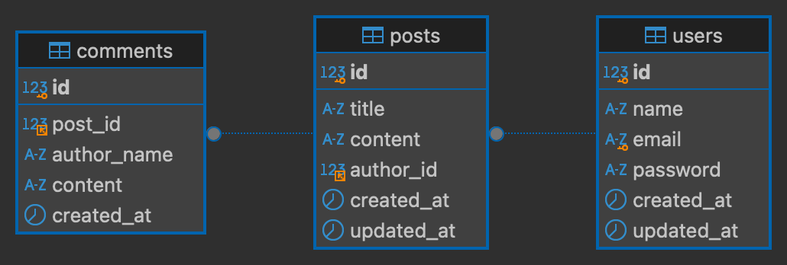

# Take-Home Test for Backend Engineer

**Notice:** You are not required to complete 100% of the task. Please do your best within the given time frame, and focus on demonstrating your skills and approach to problem-solving. We are interested in seeing your thought process and how you tackle the core aspects of the task.

## Task: Building a Simple Blog Platform

Create a RESTful API using Golang that allows users to perform CRUD operations on blog posts and comments, with user registration and login functionality. The data should be stored in a MySQL database.

### Entities

**User**

- id (integer, primary key)
- name (string)
- email (string, unique)
- password_hash (string)
- created_at (timestamp)
- updated_at (timestamp)

**Blog Post**

- id (integer, primary key)
- title (string)
- content (text)
- author_id (integer, foreign key referencing User)
- created_at (timestamp)
- updated_at (timestamp)

**Comment**

- id (integer, primary key)
- post_id (integer, foreign key referencing Blog Post)
- author_name (string)
- content (text)
- created_at (timestamp)

### API Endpoints

**User Registration & Authentication**

- `POST /register` - Register a new user.
- `POST /login` - Login and receive a token for authentication.

**Blog Posts**

- `POST /posts` - Create a new blog post.
- `GET /posts/{id}` - Get blog post details by ID.
- `GET /posts` - List all blog posts.
- `PUT /posts/{id}` - Update a blog post.
- `DELETE /posts/{id}` - Delete a blog post.

**Comments**

- `POST /posts/{id}/comments` - Add a comment to a blog post.
- `GET /posts/{id}/comments` - List all comments for a blog post.

### Database Designs

Provide a MySQL schema design that reflects the above entities and their relationships.
Ensure proper indexing for performance optimization.



## Evaluation Criteria

- Code quality and organization.
- Completeness of the required features.
- Security measures (e.g., authentication implementation).
- Creativity and problem-solving approach, especially if modifications to the entities were made.

## Setup Instructions

### Option 1: Using Docker

If you have Docker installed, you can start the app with the following commands:

```
docker-compose build
docker-compose up
```

The server will be up and running at http://localhost:8080.

### Option 2: Manual Setup

If you prefer to set up the web server manually, ensure you have the following prerequisites:

- Go version 1.21.0
- MySQL version 8.0

Once the prerequisites are ready:

1. Install [Air](https://github.com/air-verse/air), a live reload tool for Go.
2. Navigate to the `./app` directory.
3. Start the server by running `air`.

## Submission Instructions

Push your code to a Git repository and send us the link.
